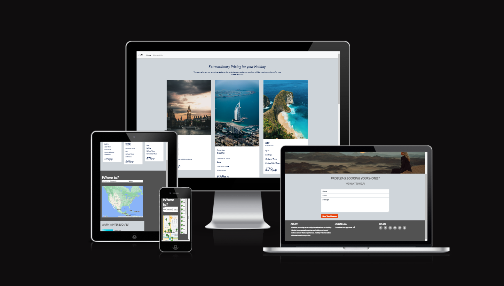
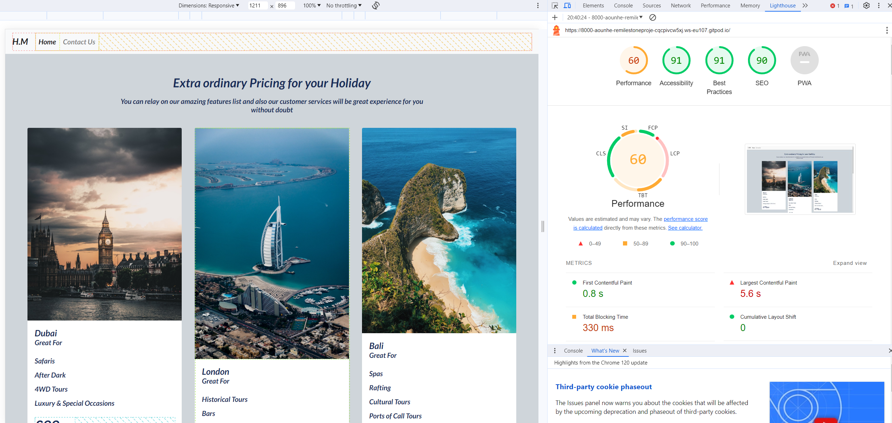

<h1 style="text-align: center">Holiday Market</h1>

This is my submission for Milestone project 2. The Holiday Market site got a map with a search box that finds all of the hotels in a specified place within a given country. The map then displays markers for all of the hotels returned, with on-click details for each hotel.

### User Experience (UX) ###

* As a visitor, I want to see where the locations of all the hotels in the area that i'm intrest in.

* As a visitor, it's important to read the hotels reviews to decied wich one i will book.

* As a visitor, I really need information on where to stay.

### Design ###

* WireFrames:
Desktop and Mobile wireframes.

* Features:
Responsive layout on mobile and tablet. Interactive Maps, email.

### Technologies: ###

- GitHub: [https://github.com/](https://github.com/)
  - GitHub was used to host the applications repositories.
- GitPod: [https://www.gitpod.io/](https://www.gitpod.io/)
  - GitPod served as the integrated development environment used to code the site.
- HTML: [https://developer.mozilla.org/en-US/docs/Web/HTML](https://developer.mozilla.org/en-US/docs/Web/HTML)
  - The website uses HTML to input the structure and content.
- CSS: [https://developer.mozilla.org/en-US/docs/Web/CSS](https://developer.mozilla.org/en-US/docs/Web/CSS)
  - The website uses CSS to style the HTML elements.
- Bootstrap 4: [https://getbootstrap.com/](https://getbootstrap.com/)
  - The website uses the Bootstrap 4 framework to simplify the integration and styling of responsive elements.
- JavaScript: [https://developer.mozilla.org/en-US/docs/Web/JavaScript](https://developer.mozilla.org/en-US/docs/Web/JavaScript)
  - The site uses JavaScript to enable interactive user events and to incorporate features from the following APIs: Google Maps JavaScript API, Google Maps Embed API.
- Google Maps JavaScript API: [https://developers.google.com/maps/documentation/javascript/overview](https://developers.google.com/maps/documentation/javascript/overview)
    - The index.html page uses the Google Maps JavaScript API to power a Geography Challenge.
- Google Maps Embed API: [https://developers.google.com/maps/documentation/embed/get-started](https://developers.google.com/maps/documentation/embed/get-started)
  - The index.html page uses the Google Maps JavaScript API to provide users with information on accommodation.
- EmailJS: [https://www.emailjs.com/](https://www.emailjs.com/)
  - EmailJS was use to link the contact form on contact.html to a functioning email account.
- Google Fonts: [https://fonts.google.com/](https://fonts.google.com/)
  - The site uses Google Fonts to integrate the Lato font into the website.
- Fontawesome: [https://fontawesome.com/](https://fontawesome.com/)
  - The site uses Font Awesome to integrate social media icons into the footer.

<h2 style="text-align: center">Testing</h2>

The W3C Markup Validator, W3C CSS and JSHint Validator Services were used to validate the project pages to ensure
there were no syntax errors.

* [W3C Markup validator](https://validator.w3.org/#validate_by_input)
No errors were returned from the HTML validator.

* [W3C CSS validator](https://jigsaw.w3.org/css-validator/validator)
No errors were returned from the CSS validator

* [JSHint](https://jshint.com/)
No errors or warnings shown

* [Lighthouse](https://developer.chrome.com/docs/lighthouse/overview/)

<h2 style="text-align: center">Deployment</h2>

### GitHub Pages ###
The project was deployed to GitHub Pages using the following steps...

#### Log in to GitHub and locate the GitHub Repository ####

* At the top of the repository section, locate the "Settings" Button on the menu.
* Scroll down the settings page until you find the "GitHub Pages" section.
* You will see a message "Pages settings now has its own dedicated tab! Check it out here!" click on the link.
* Under "Source", click the dropdown and select "Master Branch".The page will refresh.
* The now published site link in the "GitHub Pages" section will be found at the top of the page.

### Forking the GitHub Repository ###
By forking the GitHub Repository we make a copy of the original repository on our GitHub account to view and/or make changes without affecting the original repository by using the following steps...

#### Log in to GitHub and locate the GitHub Repository ####

* At the top of the repository section just above the "Settings" button on the menu, click the "Fork" button.
  The original repository in your GitHub account should now have duplicated.

#### Making a Local Clone ####

* Log in to GitHub and locate the GitHub repository, under the repository name, click "clone or download".
* To clone the repository using HTTPS, under "Clone with HTTPS", copy the link.
* Open Git Bash
* Change the current working directory to the location where you want the cloned directory to be made.
* Type git clone, and then paste the URL you copied in Step 2.
   * $ git clone https://github.com/YOUR-USERNAME/YOUR-REPOSITORY
* Press Enter. Your local clone will be created.
   * $ git clone https://github.com/YOUR-USERNAME/YOUR-REPOSITORY
> Cloning into `CI-Clone`...
> remote: Counting objects: 10, done.
> remote: Compressing objects: 100% (8/8), done.
> remove: Total 10 (delta 1), reused 10 (delta 1)
> Unpacking objects: 100% (10/10), done.

<h2 style="text-align: center">Credits</h2>

#### Image credits ####

* [Unsplash.com](https://unsplash.com/)

#### API ####

* [Google Map Platform](https://developers.google.com/maps/documentation/javascript/examples/places-autocomplete-hotelsearch)
